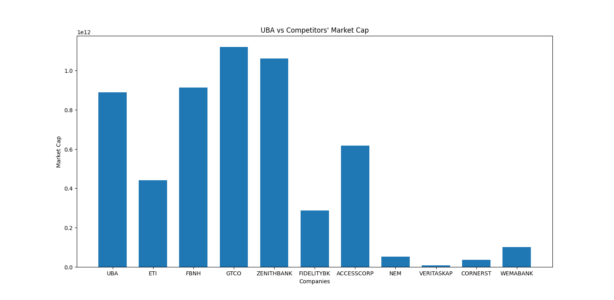
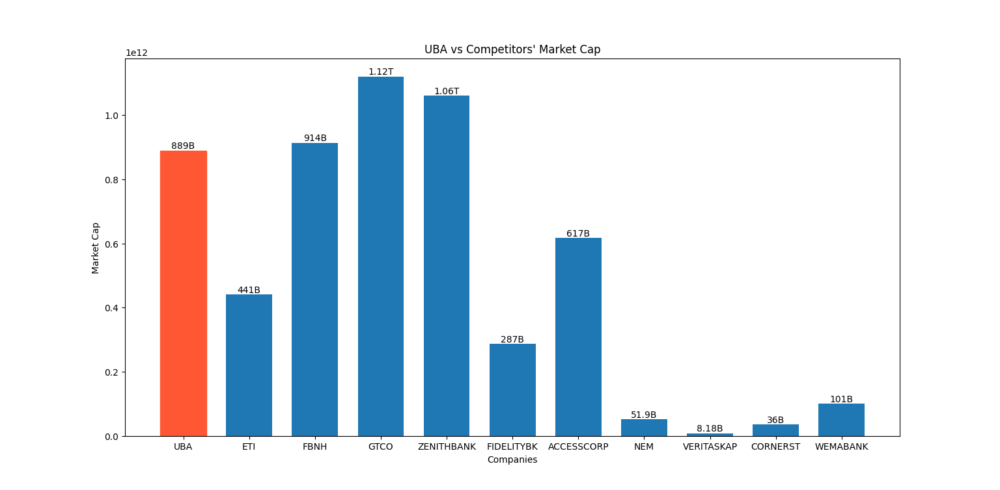

This tutorial aims to show you how you can manipulate the data Afrimarket provides for data visualization.

By the end of this tutorial, you will learn how to build a bar chart that compares the market capitalization of a specific stock to that of its competitors in the same exchange.

## **Build a Barchart With Afrimarket and Matplotlib**
The objective of this exercise is to build a bar chart to visualize how a stock is doing compared to its competitors by market capitalization. By doing so, you will learn how to manipulate the data you get from Afrimarket.

Start by importing the necessary libraries:
```python
import matplotlib.pyplot as plt
import numpy as np
import afrimarket as afm
```
!!! note
    If you don't have the above libraries installed, you should first install them with pip.

After you install and import the necessary libraries, you should follow the next steps.

## **Data Sorting**
Afrimarket provides a lot of methods to access different data. You need to decide what data to use and how to use it. To complete this tutorial, you should stick to the market capitalization of the UBA stock and its competitors in the Nigerian Market Exchange.

### Step 1: Get the UBA Stock and Its Competitors
You can initialize the UBA stock like this:
```python
uba_stock = afm.Stock("uba", market="ngx")
```
Once you have initialized the UBA stock, the next thing to do is get its competitors in the market. You can use the `get_competitors()` method to achieve this:
```python
competitors = uba_stock.get_competitors()
```
You can read about the `get_competitors()` method in the [Methods Page](./methods.md#get_competitors).

### Step 2: Get the Tickers and Market Capitalization of Each Stock
Tickers are the codes used to identify a stock in an exchange. To get the tickers for the UBA stocks and its competitors, you should define a list like this:
```python
tickers = ["UBA"]
```
The first value of the list is "UBA" because we already know the ticker and we want to keep it in first place on the bar chart.

The tickers for the UBA stock competitors should be accessed dynamically because you might not know the stocks competing with UBA. Here's how you can get the tickers dynamically:
```python
for index, row in competitors.iterrows():
    competitors_ticker = row['Code']
    tickers.append(competitors_ticker)
```
The code above loops through the `competitors` data frame and appends each value under the `Code` column to the `tickers` list defined earlier.

The next thing to do is get the market capitalization of all the stocks. First, you should get the market capitalization of the UBA stock. The [`get_growth_and_valuation()` method](./methods.md#get_growth_and_valuation) has a row that contains the market capitalization of the stock. Here's how you can retrieve the UBA market capitalization with this method:
```python
# get the growth and valuation of the uba stock
uba_growth_val = uba_stock.get_growth_and_valuation()

# access the market capitalization row and retrieve its value
uba_market_cap = uba_growth_val.loc[uba_growth_val['Growth & Valuation'] == 'Market Capitalization', 'Growth & Valuation.1'].values[0]

# create a list and add the market capitalization to it
market_caps = [uba_market_cap]
```
The code snippet above simply retrieves the market capitalization for the UBA stock and adds it to a list called `market_caps`.

Next, you should get the market capitalization of the competitors of the UBA stock. The `get_competitors()` method returns the market capitalization of each competitor as part of its result, so you only need to retrieve it similarly to the tickers and append it to the `market_caps` list:

```python
for index, row in competitors.iterrows():
    competitors_market_cap = row['M. Cap.']
    market_caps.append(competitors_market_cap)
```

### Step 3: Convert Market Capitalization Values to Numeric Values
If you print the `market_caps` list, you will see a list of strings as the output:
```shell
['889B', '441B', '914B', '1.12T', '1.06T', '287B', '617B', '51.9B', '8.18B', '36B', '101B']
```
The result above is good for labeling, but cannot be used to create the bar chart because you need numeric values to achieve that. Therefore, you should convert the values in the `market_caps` list to their corresponding numeric values.

A simple way to achieve this is by using a function:
```python
# method to convert market cap to actual numbers
def convert_market_cap(value):
    suffixes = {'B': 1e9, 'T': 1e12}
    suffix = value[-1]
    if suffix in suffixes:
        return float(value[:-1]) * suffixes[suffix]
    else:
        return float(value)
```

The function above takes a single value, determines if it is a billion or a trillion, multiplies the value by the appropriate digit, and casts it to a float that you can use to plot a chart. You can call the method on each `market_cap` value like this:
```python
market_caps_numerics = [convert_market_cap(value) for value in market_caps]
```
If you print the `market_caps_numerics` variable, you will get a list containing actual numeric values.

## Plotting the Chart
Now that you have sorted the data you need for the chart, the only thing left is to plot it.

The values for the x-axis will be the `tickers` and the y-axis will be the `market_caps_numerics`. The following code snippet will show you how to plot a bar chart with Matplotlib:
```python
X_axis = np.arange(len(tickers)) 
plt.bar(X_axis, market_caps_numerics, width=0.7, label="Market Cap")

plt.xticks(X_axis, tickers)
plt.xlabel("Companies") 
plt.ylabel("Market Cap")
plt.title("UBA vs Competitors' Market Cap") 
plt.show() 
```
If you run your code now, you should see a chart like this:
<figure markdown="span">
{ loading=lazy }
<figcaption>Bar chart comparing the UBA stock to its competitors in the Nigerian Exchange by Market Cap</figcaption>
</figure>

The chart above is a bit difficult to read because you can't get exact values of each stock's market capitalization. It is also difficult to identify the bar representing UBA without going through the tickers. One method to solve these issues is to label each bar with the corresponding market capitalization from the `market_caps` variable and also give a different color to bar representing the UBA stock. To do this, modify the last bit of code to look like this:
```python
X_axis = np.arange(len(tickers)) 
bars = plt.bar(X_axis, market_caps_numerics, width=0.7, label="Market Cap")
bars[0].set_color('#FF5733')
for i, bar in enumerate(bars):
    plt.text(bar.get_x() + bar.get_width() / 2, bar.get_height(), market_caps[i], ha='center', va='bottom')


plt.xticks(X_axis, tickers)
plt.xlabel("Companies") 
plt.ylabel("Market Cap")
plt.title("UBA vs Competitors' Market Cap") 
plt.show() 
```

Now, if you run your code, you should see a chart like this:
<figure markdown="span">
{loading=lazy}
<figcaption>Bar chart comparing the UBA stock to its competitors in the Nigerian Exchange by Market Cap.</figcaption>
</figure>

In this new chart, the market capitalization of each stock sits on the corresponding bar, and the UBA bar has a different color to make it distinct. You can compare your final code with the one on GitHub if you run into any errors.

Now that you know how to manipulate the data available in Afrimarket, you can go ahead to build more complex visualizations.